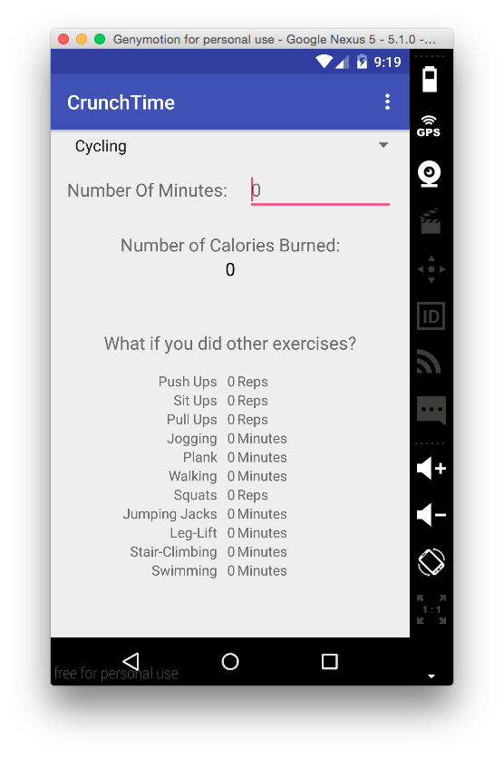
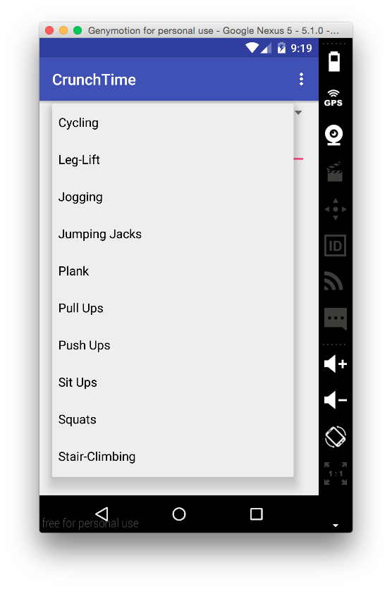
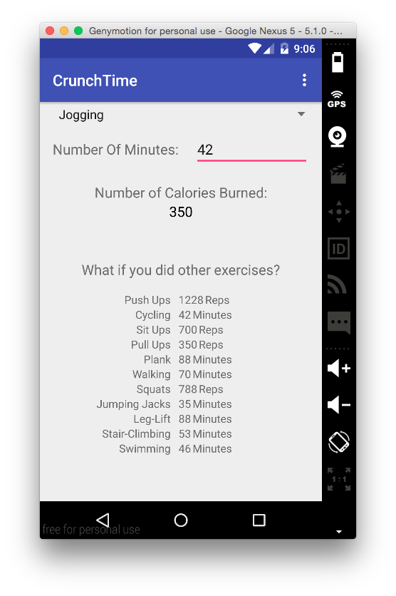
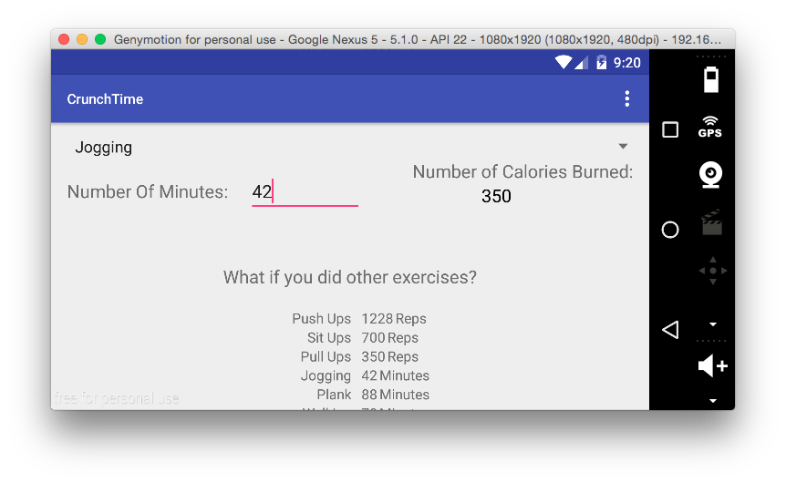

# PROG 01: Crunch Time

CrunchTime is an app that allows users to enter the number of minutes/reps of an activity performed and receive the number of calories they burned while doing that activity.

## Authors

Neil Jagtiani ([njagtiani@berkeley.edu](mailto:your_email@berkeley.edu))

## Demo Video

See CrunchTime (https://vimeo.com/neiljag/cs160prog01) (password: crunctime)

## Screenshots

## Acknowledgments

* Hat tip to anyone who's code was used
* Any other support

*Feel free to enhance your README. For Markdown syntax, see [the GitHub Guides](https://guides.github.com/features/mastering-markdown/). Remove this line in your submission.*
